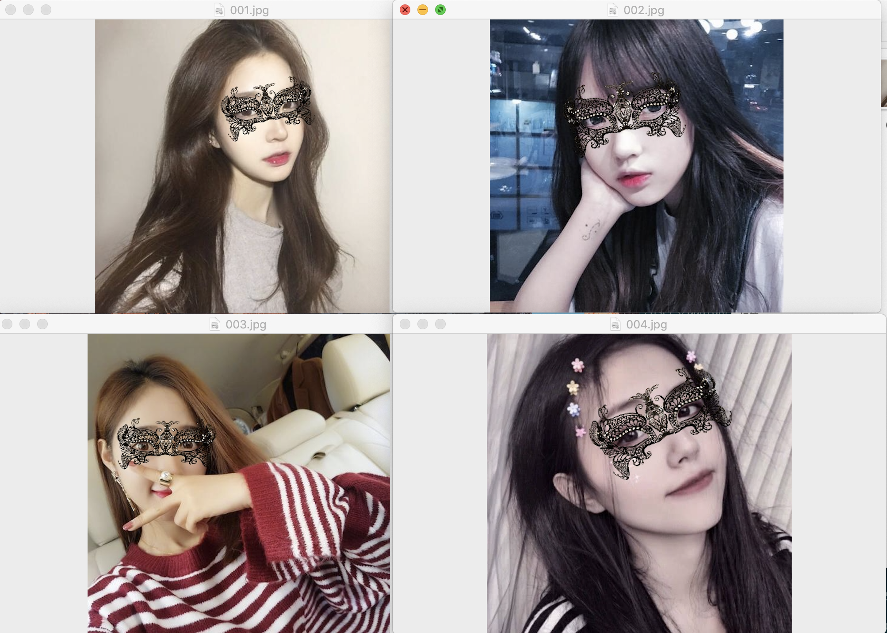

本项目实现人脸贴纸：
>（1）人脸检测使用的是mtcnn。
>（2）通过放射变换将贴纸映射到面部。
>（3）使用numba，实现实时人脸贴纸。

代码运行：
> git clone https://github.com/MachineLP/face_stickers
> cd fase_stickers
> 图片测试：python test.py
> 视频测试：python video.py

效果如下：
  
